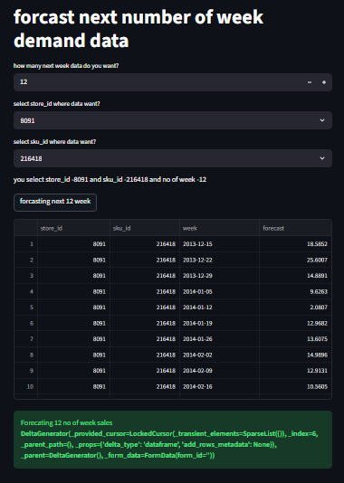

Project Title-
        Multi-Store Retail Demand Forecasting using Time Series and Machine Learning
        (EDA + ML Model + FastAPI + Streamlit + Docker)
        

Project Description-
            This project forecasts product demand using machine learning.
            The system is built using FastAPI for the backend API and
            Streamlit for the interactive dashboard. The application is
            containerized using Docker and deployed using Docker Compose.

## Exploratory Data Analysis (EDA)-

    Exploratory Data Analysis was performed to understand sales patterns and demand behavior across stores and products.
    
    Key analysis performed:
    - Sales trend analysis over time
    - Store-wise demand distribution
    - SKU-level sales behavior
    - Seasonality and trend detection
    - Missing value handling and preprocessing
    
    The complete EDA with visualizations is available in the notebook:
        Demand_Forecasting_Project.ipynb

## Feature Engineering-
    
    To improve model performance, several features were created:
    
    - Lag features (previous sales values)
    - Rolling mean statistics
    - Time-based features (day, week, month)

## Machine Learning Models-

    Different machine learning models were explored for demand forecasting:
    
    
    - Time series analysis (SARIMA/ARIMA)
    - XGBoost Regressor
    
    After experimentation, **XGBoost** was selected as the final model due to its better performance.

## Model Evaluation-
    
    The model performance was evaluated using regression metrics:
    
    - MAE (Mean Absolute Error)
    - RMSE (Root Mean Squared Error)
    
    The trained model was saved as:
    
    model/sales_forecasting_model.pkl

    ## Model Explainability
    SHAP (SHapley Additive exPlanations) was used to understand the impact of features on model predictions and interpret the ml model

Architecture (Brief Explanation)-
            User → Streamlit Dashboard → FastAPI API → ML Model → Prediction 

Tech Stack-

    Programming-
        Python
    Data Processing & Analysis-
        Pandas
        NumPy
    Machine Learning-
        Scikit-learn
        XGBoost
        Time Series Forecasting Models
    Model Explainability-
        SHAP
    API Development-
        FastAPI
        Pydantic
    Frontend Dashboard-
        Streamlit
    Data Visualization-
        Matplotlib
        Seaborn
    Containerization & Deployment-
        Docker
        Docker Compose
    Development Tools-
        Jupyter Notebook
        Git
        GitHub

Screenshots-
        Dashboard Preview:
        
            

Project File Structure-
    Demand forecasting project:

        PROJECT-1-DEMAND-FORECASTING
        │
        ├── data_available
        │ ├── data_format_required.csv
        │ ├── testing_data.csv
        │ └── training_data.csv
        │
        ├── data_created
        │ ├── last_data.csv
        │ └── unique_store_sku.py
        │
        ├── model
        │ └── sales_forecasting_model.pkl
        │
        ├── run_docker_file_directly
        │ ├── docker-compose.yml
        │ ├── run_project.bat
        │ └── stop_project.bat
        │
        ├── src
        │ ├── Demand_Forecasting_Project.ipynb
        │ ├── Dockerfile.fastapi
        │ ├── Dockerfile.streamlit
        │ ├── fastapi_model.py
        │ ├── ml_model.py
        │ ├── pydantic1.py
        │ └── streamlit.py
        │
        ├── requirements.txt
        ├── screenshot.png
        ├── README.md
        └── .gitignore

Docker Hub Images-

        FastAPI Image:
        https://hub.docker.com/r/chetansgode/project-1-demand-forecasting-fastapi

        Pull Command:
        docker pull chetansgode/project-1-demand-forecasting-fastapi

        Streamlit Image:
        https://hub.docker.com/r/chetansgode/project-1-demand-forecasting-streamlit

        Pull Command:
        docker pull chetansgode/project-1-demand-forecasting-streamlit

Installation Instructions-

    Option 1: Step-by-Step Setup (Full Installation)

             ## How to Run the Project

            ### Step 1: Install Docker
            Download and install Docker Desktop.

             ### Step 2: Clone the Repository 

            git clone https://github.com/chetansgode/Demand_Forecasting_Project.git
       

             ### Step 3: Navigate to Docker Folder in terminal

              cd docker_folder_path(above clone repo folder path)

            ### Step 4: Run the Project by  running below command in terminal
                 #docker image created 
                docker compose up --build 
                
            Access the Application-
                Streamlit Dashboard:
                     http://localhost:8501

                FastAPI Documentation:
                    http://localhost:8000/docs
            
            #docker container stop-
                docker compose down

    Option 2: Quick Start (Recommended)
            Run the project without downloading the entire repository.

             ### Step 1: Install Docker  (if not)
             Download and install Docker Desktop.

             ### Step 2: Clone the Repository 
            ## Only download this folder from the GitHub repository
                -https://github.com/chetansgode/Demand_Forecasting_Project
                    select and download folder >>>***run_docker_file_directly***
            
                        ├── run_docker_file_directly
                        │ ├── docker-compose.yml
                        │ ├── run_project.bat
                        │ └── stop_project.bat

            ### step 3: in terminal select current path (above folder current path)
              eg.  C:\Users\Cheta\Desktop\Project-1-Demand_forecasting\run_docker_file_directly (replace path)
        
            ### step 4:run project
             #in terminal (write below file name and enter then automatically it run everything )
             run_project.bat

            Access the Application-
                 Streamlit Dashboard:
                 http://localhost:8501

            FastAPI Documentation:
                http://localhost:8000/docs

            Stop the Project-
                    stop_project.bat

## Conclusion-

    This project demonstrates an end-to-end machine learning pipeline for retail demand forecasting.
    
    Key highlights:
    - Complete Exploratory Data Analysis
    - Feature engineering and time series feature creation
    - Machine learning model training and evaluation
    - FastAPI backend for prediction
    - Streamlit dashboard for visualization
    - Docker containerization for deployment
    
    This system can help retailers predict product demand and optimize inventory management.